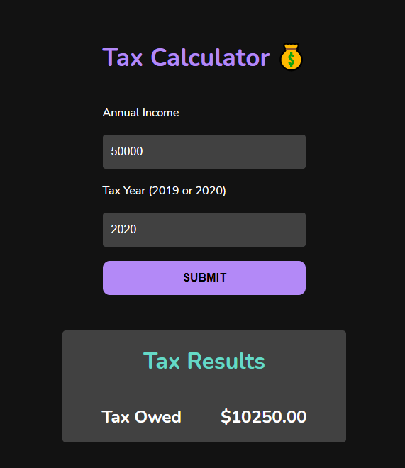
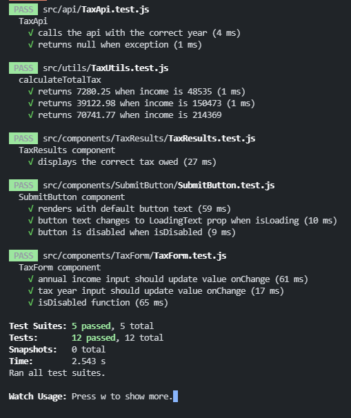
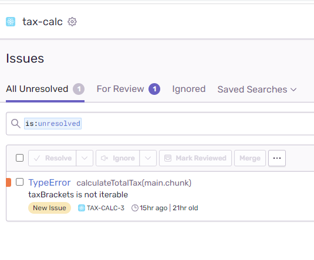

# Documentation: Tax Calculator Assignment

This project is a single page React application, scaffolded with Create React App.

## Instructions

- The application can be installed with `npm install`
- Run the application with `npm start` , then open [http://localhost:3000](http://localhost:3000) to view it in the browser.
- The Tax API server must be running to get results from the form.
- Execute tests with `npm test` or `npm test -- --verbose` to show individual test results.

## Basic Code structure and Libraries

In this project, functional components and hooks are used in favor of class components and lifecycle methods.

The project file structure is grouped by file type.

- React components exist within [src/components](./src/components).
- Utility functions are in [src/utils](./src/utils).
- API functions are in [src/api](./src/api).

**Styling** is done via the CSS-in-JS library [styled-components](https://styled-components.com/). Styles are co-located within their respective component folder and suffixed with `.style.js`.

**ESLint** is used, however only to check syntax and find problems. Code style is not enforced in this configuration.

**Prop types** are checked with the [prop-types](https://www.npmjs.com/package/prop-types) library, to achieve runtime type checking for custom component props.

## Automated Testing

Jest and React Testing Library were chosen for unit tests.

Tests are co-located in their respective folders and suffixed with `.test.js`.

Cypress for e2e testing would have been nice, but not currently present due to time constraints.

## Error Logging

[Sentry](https://sentry.io/) is implemented within this project and used for logging.

All potentially unhandled errors, and known (api) handled errors will be logged to Sentry.

## To Do

While I tried to add everything I could, due to time constraints, there are things what would have been nice to have but not included:

- End 2 End testing with Cypress.
- An ESLint configuration that enforces code style.
- Better composition of styles, perhaps define a global theme.
- (If the app were scaled to multiple screens) - potentially a state management library like Redux.
